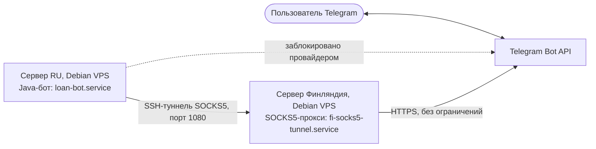

# Развёртывание и эксплуатация

## Инфраструктура

Приложение развёрнуто на выделенном сервере под управлением операционной системы Debian с постоянным IP-адресом, что обеспечивает круглосуточную доступность бота для пользователей Telegram независимо от состояния локального устройства разработчика.

В процессе развёртывания была обнаружена блокировка исходящих соединений к Telegram Bot API на уровне сетевого провайдера основного сервера. Проблема решена маршрутизацией трафика бота через второй сервер (без подобных ограничений) с помощью SOCKS5-прокси поверх SSH-туннеля.

### Схема серверов



Бот и клиент пользователя обращаются к Telegram Bot API независимо друг от друга: сообщения пользователя доставляются боту через long polling, а исходящие запросы бота (отправка ответов, получение обновлений) идут не напрямую, а через туннель на сервер в Финляндии, откуда доступ к Telegram не ограничен.

## Проблема: сетевая блокировка Telegram API

Диагностика проводилась последовательно:

1. Первым проявлением была ошибка `SocketException: Network is unreachable` — сервер имел только локальный (link-local) IPv6-адрес без глобального маршрута, а библиотека `telegrambots` по умолчанию пыталась использовать IPv6. Устранено принудительным переключением JVM на IPv4: параметр `-Djava.net.preferIPv4Stack=true`.
2. После этого при подключении к `api.telegram.org` стабильно возникал `ConnectTimeoutException`, тогда как соединения к другим внешним сервисам (Maven Central, GitHub, стандартные репозитории пакетов) работали без проблем. Это подтвердило, что ограничение точечное — блокируется именно трафик к Telegram, а не сеть в целом.

Поскольку смена хостинг-провайдера была нежелательна, было принято архитектурное решение вынести исходящий трафик бота на сервер без такой блокировки.

## Решение: SOCKS5-прокси через второй сервер

Туннель поднимается утилитой `autossh` с динамическим пробросом порта:

```bash
autossh -M 0 -N -D 127.0.0.1:1080 \
  -o "ServerAliveInterval 30" -o "ServerAliveCountMax 3" \
  -o "ExitOnForwardFailure yes" \
  -i /root/.ssh/fi_tunnel root@<ip-финского-сервера>
```

`autossh` отслеживает соединение и автоматически переустанавливает туннель при обрыве связи (параметры `ServerAliveInterval`/`ServerAliveCountMax`).

На стороне приложения поддержка прокси реализована через штатный механизм библиотеки `telegrambots`:

```java
DefaultBotOptions botOptions = new DefaultBotOptions();
if (proxyHost != null && proxyPortEnv != null) {
    botOptions.setProxyHost(proxyHost);
    botOptions.setProxyPort(Integer.parseInt(proxyPortEnv));
    botOptions.setProxyType(DefaultBotOptions.ProxyType.SOCKS5);
}
```

Адрес и порт прокси задаются переменными окружения `PROXY_HOST` / `PROXY_PORT` и подключаются опционально — при их отсутствии бот обращается к Telegram напрямую. Это сохраняет портируемость приложения: на хостинге без подобных сетевых ограничений прокси просто не потребуется.

## Отказоустойчивость: systemd

Оба процесса — бот и SSH-туннель — зарегистрированы как сервисы `systemd` с автоматическим перезапуском при сбое.

Юнит бота:

```ini
[Unit]
Description=Loan Telegram Bot
After=network.target fi-socks5-tunnel.service
Requires=fi-socks5-tunnel.service

[Service]
WorkingDirectory=/opt/Loan-Bot-TG
Environment=BOT_TOKEN=...
Environment=BOT_USERNAME=...
Environment=PROXY_HOST=127.0.0.1
Environment=PROXY_PORT=1080
Environment=DB_PATH=/opt/Loan-Bot-TG/loan-bot.db
Environment=MANAGER_LOGIN=...
Environment=MANAGER_PASSWORD=...
ExecStart=/opt/Loan-Bot-TG/start.sh
Restart=on-failure
RestartSec=5
User=root

[Install]
WantedBy=multi-user.target
```

Юнит бота объявлен зависимым от юнита туннеля (`Requires=`, `After=`) — это гарантирует, что прокси-соединение будет установлено до старта самого приложения. Такой подход исключает необходимость держать активную SSH-сессию для работы бота и обеспечивает автоматический запуск обоих сервисов при перезагрузке сервера.

## Безопасность конфигурации

Конфиденциальные параметры (токен Telegram-бота, учётные данные менеджера, параметры прокси и путь к базе данных) передаются исключительно через переменные окружения и не хранятся в исходном коде или в системе контроля версий. Файлы `.env`, `application.properties`, `application.yml`, а также файл базы данных SQLite (`*.db`) исключены из репозитория через `.gitignore`.
