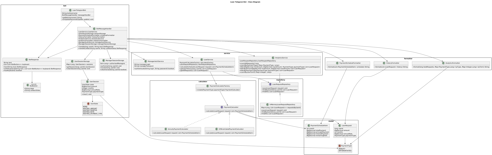

Loan Telegram Bot

Описание проекта

Loan Telegram Bot — это Telegram-бот для расчёта кредитов, разработанный на Java.

Бот позволяет пользователям рассчитывать графики погашения кредита по двум схемам:

* Аннуитетные платежи
* Дифференцированные платежи

История запросов пользователей сохраняется в базе данных (SQLite) и переживает перезапуск бота. Для менеджеров реализована защищённая авторизацией аналитика по всем заявкам.

⸻

Функциональные возможности

Пользователь

Поддерживаются следующие команды:

/start

Отображает приветственное сообщение и список доступных команд, а также inline-кнопки быстрого доступа («Рассчитать кредит», «История»).

/calculate

Запускает пошаговый диалог:

1. Ввод суммы кредита
2. Ввод срока кредита в месяцах
3. Ввод процентной ставки
4. Выбор типа платежа — предлагается inline-клавиатурой («Аннуитетный» / «Дифференцированный»), ввод текстом (1 или 2) также поддерживается

При вводе суммы и ставки поддерживается запятая как разделитель дробной части (например, «12,5» распознаётся как 12.5).

После ввода параметров бот формирует помесячный график платежей; суммы в ответах бота форматируются с разделителем разрядов (например, «1 250 000»).

/history

Показывает историю ранее выполненных расчётов пользователя.

/cancel

Прерывает текущий диалог /calculate на любом шаге, не дожидаясь его завершения.

⸻

Менеджер

Доступ для менеджеров защищён авторизацией по логину и паролю (переменные окружения MANAGER_LOGIN / MANAGER_PASSWORD).

/manager_login <логин> <пароль>

Авторизует текущего пользователя Telegram как менеджера. Авторизация хранится в памяти процесса на время его работы.

/manager_logout

Отменяет авторизацию менеджера для текущего пользователя.

/analytics (только для авторизованных менеджеров)

Показывает агрегированную аналитику:

* Подсчёт общего количества запросов
* Статистика по типам платежей
* Статистика по срокам кредитования

/filter <мин.сумма> <макс.сумма> [ANNUITY|DIFFERENTIATED] (только для авторизованных менеджеров)

Возвращает список заявок, отфильтрованных по диапазону суммы и, опционально, по типу платежа.

⸻

Используемые технологии

* Java 21
* Maven
* TelegramBots API
* SQLite (JDBC)
* Java Collections Framework
* Git
* GitHub

⸻

Архитектура проекта

Проект построен по принципам разделения ответственности.

Структура проекта

src/main/java/com/example/loanbot
├── Main.java
├── bot
│   ├── LoanTelegramBot.java
│   ├── BotMessageHandler.java
│   ├── BotResponse.java
│   ├── BotButton.java
│   ├── UserSession.java
│   ├── UserSessionStorage.java
│   ├── UserState.java
│   └── ManagerSessionStorage.java
├── model
│   ├── LoanRequest.java
│   ├── PaymentScheduleItem.java
│   └── PaymentType.java
├── calculator
│   ├── PaymentCalculator.java
│   ├── AnnuityPaymentCalculator.java
│   ├── DifferentiatedPaymentCalculator.java
│   └── PaymentCalculatorFactory.java
├── repository
│   ├── LoanRequestRepository.java
│   ├── InMemoryLoanRequestRepository.java
│   └── SqliteLoanRequestRepository.java
├── service
│   ├── LoanService.java
│   ├── AnalyticsService.java
│   └── ManagerAuthService.java
└── formatter
    ├── PaymentScheduleFormatter.java
    ├── HistoryFormatter.java
    ├── AnalyticsFormatter.java
    └── MoneyFormatter.java

⸻

Диаграмма классов

Исходник в формате PlantUML: docs/class-diagram.puml.

⸻

Архитектурная схема

Telegram
    |
    v
LoanTelegramBot
    |
    v
BotMessageHandler
    |
    v
LoanService
    |
    v
PaymentCalculatorFactory
    |
    +----------------------+
    |                      |
    v                      v
Annuity           Differentiated
Calculator        Calculator
LoanService
    |
    v
LoanRequestRepository
    |
    v
SqliteLoanRequestRepository / InMemoryLoanRequestRepository

⸻

Использование паттерна Factory

Для создания различных типов калькуляторов используется паттерн Factory.

PaymentCalculator calculator =
        calculatorFactory.create(paymentType);

В зависимости от выбранного пользователем типа платежа создаётся:

* AnnuityPaymentCalculator
* DifferentiatedPaymentCalculator

⸻

Применение принципов SOLID

SRP (Single Responsibility Principle)

Каждый класс отвечает только за одну задачу.

Примеры:

* LoanService — бизнес-логика кредита
* AnalyticsService — аналитика
* HistoryFormatter — форматирование истории
* MoneyFormatter — форматирование денежных сумм
* LoanTelegramBot — взаимодействие с Telegram

OCP (Open Closed Principle)

Для добавления нового типа платежа достаточно создать новый калькулятор и расширить Factory.

LSP (Liskov Substitution Principle)

Все реализации PaymentCalculator взаимозаменяемы. Аналогично взаимозаменяемы SqliteLoanRequestRepository и InMemoryLoanRequestRepository — переключение между ними в Main.java не требует изменений в остальном коде.

ISP (Interface Segregation Principle)

Используются небольшие специализированные интерфейсы.

DIP (Dependency Inversion Principle)

Сервисы зависят от абстракций:

LoanRequestRepository
PaymentCalculator

а не от конкретных реализаций.

⸻

Использование принципов разработки

DRY

Повторяющийся код вынесен в отдельные классы и методы (например, форматирование сумм — в MoneyFormatter, используется и в PaymentScheduleFormatter, и в HistoryFormatter).

KISS

Логика приложения максимально проста и понятна.

YAGNI

Реализован только необходимый функционал без преждевременного усложнения архитектуры.

⸻

Сборка проекта

Скомпилировать проект:

mvn clean compile

Создать артефакт:

mvn clean package

⸻

Настройка Telegram Bot

Создать бота через BotFather.

Получить:

* BOT_TOKEN
* BOT_USERNAME

Настроить переменные окружения.

Linux:

export BOT_TOKEN="your_token"
export BOT_USERNAME="your_bot_username"

Windows:

set BOT_TOKEN=your_token
set BOT_USERNAME=your_bot_username

⸻

Хранилище данных

По умолчанию (без переменной окружения DB_PATH) история заявок хранится в памяти процесса и теряется при перезапуске.

Чтобы использовать постоянное хранилище на базе SQLite, нужно задать путь к файлу базы данных:

Linux:

export DB_PATH="/opt/Loan-Bot-TG/loan-bot.db"

Windows:

set DB_PATH=C:\loan-bot\loan-bot.db

Файл и таблица создаются автоматически при первом запуске.

⸻

Доступ менеджера

Для защищённых команд менеджера (/analytics, /filter) нужно задать логин и пароль через переменные окружения:

Linux:

export MANAGER_LOGIN="manager"
export MANAGER_PASSWORD="your_password"

Windows:

set MANAGER_LOGIN=manager
set MANAGER_PASSWORD=your_password

Если переменные не заданы, авторизация менеджера всегда отклоняется — остальной функционал бота продолжает работать как обычно.

Прокси (опционально)

Если исходящие соединения к api.telegram.org заблокированы в сети сервера, бот можно направить через SOCKS5-прокси, задав:

export PROXY_HOST="127.0.0.1"
export PROXY_PORT="1080"

Если переменные не заданы, бот подключается к Telegram напрямую.

⸻

Запуск проекта

Запуск через Maven:

mvn exec:java -Dexec.mainClass="com.example.loanbot.Main"

После запуска в консоли появится сообщение:

Бот запущен

Развёртывание на сервере (production)

Для постоянной работы бот запускается как systemd-сервис, читающий все перечисленные выше переменные окружения (BOT_TOKEN, BOT_USERNAME, DB_PATH, MANAGER_LOGIN, MANAGER_PASSWORD, PROXY_HOST/PROXY_PORT) из секции Environment= юнита. Это обеспечивает автоматический перезапуск при сбое и работу бота в фоне без активной SSH-сессии.

⸻

Возможные улучшения

В дальнейшем проект может быть расширен:

* PostgreSQL вместо SQLite при росте нагрузки
* Docker / Docker Compose
* Экспорт графиков в PDF
* Автоматизированное тестирование (JUnit)

⸻

Автор

Учебный (дипломный) проект по разработке Telegram-бота на Java.
